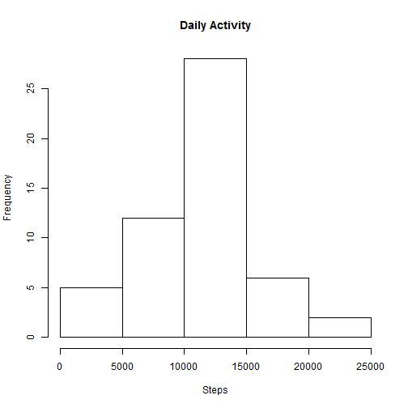
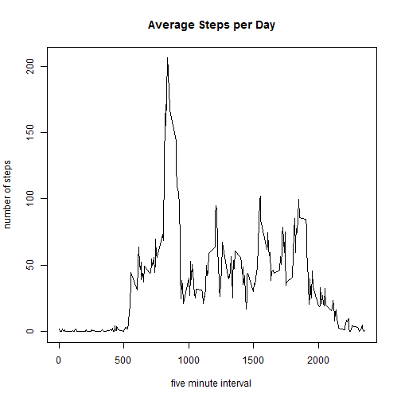
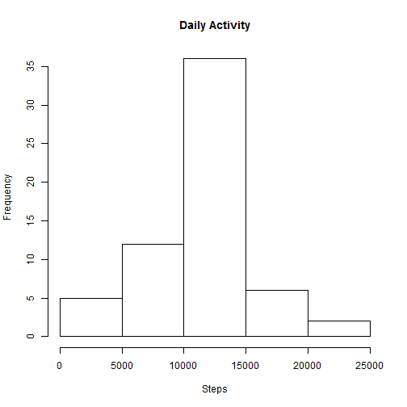
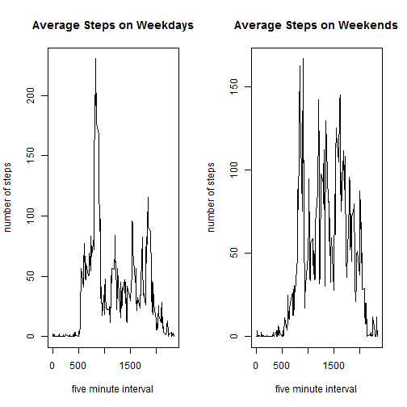

Loading and preprocessing the data
Show any code that is needed to
1.Load the data (i.e. read.csv())
2.Process/transform the data (if necessary) into a format suitable for your analysis


```r
z<-read.csv("activity.csv") ##read data
```

What is mean total number of steps taken per day?

For this part of the assignment, you can ignore the missing values in the dataset.
1.Calculate the total number of steps taken per day
2.If you do not understand the difference between a histogram and a barplot, research the difference between them. Make a histogram of the total number of steps taken each day
3.Calculate and report the mean and median of the total number of steps taken per day


```r
z<-z[complete.cases(z),] ##removeNAs
hist_data<-aggregate(z$steps, by=list(Category=z$date), FUN=sum) ##summarize total steps per day
hist(hist_data$x,main="Daily Activity",xlab="Steps") ##make a histogram
```



```r
summary(hist_data) ##shows mean and median steps per day
```

```
##        Category        x        
##  2012-10-02: 1   Min.   :   41  
##  2012-10-03: 1   1st Qu.: 8841  
##  2012-10-04: 1   Median :10765  
##  2012-10-05: 1   Mean   :10766  
##  2012-10-06: 1   3rd Qu.:13294  
##  2012-10-07: 1   Max.   :21194  
##  (Other)   :47
```

What is the average daily activity pattern?
1.Make a time series plot (i.e. type = "l") of the 5-minute interval (x-axis) and the average number of steps taken, averaged across all days (y-axis)
2.Which 5-minute interval, on average across all the days in the dataset, contains the maximum number of steps?


```r
plot_data<-aggregate(z$steps, by=list(Category=z$interval), FUN=mean) ##summarize average steps by interval
plot(plot_data,type="l",main="Average Steps per Day",xlab="five minute interval",ylab="number of steps") ##time series of steps per five minute interval, averaged across all days
```



```r
plot_data[plot_data$x==max(plot_data$x),] ##highest point on plot, interval with most steps on average
```

```
##     Category        x
## 104      835 206.1698
```

Imputing missing values

Note that there are a number of days/intervals where there are missing values (coded as NA). The presence of missing days may introduce bias into some calculations or summaries of the data.
1.Calculate and report the total number of missing values in the dataset (i.e. the total number of rows with NAs)
2.Devise a strategy for filling in all of the missing values in the dataset. The strategy does not need to be sophisticated. For example, you could use the mean/median for that day, or the mean for that 5-minute interval, etc.
3.Create a new dataset that is equal to the original dataset but with the missing data filled in.
4.Make a histogram of the total number of steps taken each day and Calculate and report the mean and median total number of steps taken per day. Do these values differ from the estimates from the first part of the assignment? What is the impact of imputing missing data on the estimates of the total daily number of steps?


```r
library(plyr)
library(Hmisc)
```

```
## Warning: package 'Hmisc' was built under R version 3.3.3
```

```
## Loading required package: lattice
```

```
## Loading required package: survival
```

```
## Warning: package 'survival' was built under R version 3.3.3
```

```
## Loading required package: Formula
```

```
## Loading required package: ggplot2
```

```
## Warning: package 'ggplot2' was built under R version 3.3.3
```

```
## 
## Attaching package: 'Hmisc'
```

```
## The following objects are masked from 'package:plyr':
## 
##     is.discrete, summarize
```

```
## The following objects are masked from 'package:base':
## 
##     format.pval, round.POSIXt, trunc.POSIXt, units
```

```r
z<-read.csv("activity.csv")##read in original data, including missing values
ok<-complete.cases(z)##complete cases
sum(!ok) ##Find total number of rows with NAs
```

```
## [1] 2304
```

```r
imputed_data <- ddply(z, "interval", mutate, imputed.steps = impute(steps, mean)) ##impute missing values
hist_data<-aggregate(imputed_data$imputed.steps, by=list(Category=imputed_data$date), FUN=sum) ##summarize total steps per day
hist(hist_data$x,main="Daily Activity",xlab="Steps") ##make a histogram
```



```r
summary(hist_data) ##shows mean and median steps per day Median 10766 Mean 10766
```

```
##        Category        x        
##  2012-10-01: 1   Min.   :   41  
##  2012-10-02: 1   1st Qu.: 9819  
##  2012-10-03: 1   Median :10766  
##  2012-10-04: 1   Mean   :10766  
##  2012-10-05: 1   3rd Qu.:12811  
##  2012-10-06: 1   Max.   :21194  
##  (Other)   :55
```


Are there differences in activity patterns between weekdays and weekends?

For this part the weekdays() function may be of some help here. Use the dataset with the filled-in missing values for this part.
1.Create a new factor variable in the dataset with two levels - "weekday" and "weekend" indicating whether a given date is a weekday or weekend day.
2.Make a panel plot containing a time series plot (i.e. type = "l") of the 5-minute interval (x-axis) and the average number of steps taken, averaged across all weekday days or weekend days (y-axis). See the README file in the GitHub repository to see an example of what this plot should look like using simulated data.


```r
imputed_data$date<-as.Date(as.character(imputed_data$date))##convert date from factor to date
weekdays1 <- c('Monday', 'Tuesday', 'Wednesday', 'Thursday', 'Friday')
#Use `%in%` and `weekdays` to create a logical vector
#convert to `factor` and specify the `levels/labels`
imputed_data$wDay <- factor((weekdays(imputed_data$date) %in% weekdays1), 
         levels=c(FALSE, TRUE), labels=c('weekend', 'weekday') )
y<-subset(imputed_data,wDay=="weekday")
x<-subset(imputed_data,wDay=="weekend")
plot_data<-aggregate(y$imputed.steps, by=list(Category=y$interval),FUN=mean)
plot_data2<-aggregate(x$imputed.steps, by=list(Category=x$interval),FUN=mean)  
par(mfrow=c(1,2))
plot(plot_data,type="l",main="Average Steps on Weekdays",xlab="five minute interval",ylab="number of steps") ##time series of steps per five minute interval, averaged across all days
plot(plot_data2,type="l",main="Average Steps on Weekends",xlab="five minute interval",ylab="number of steps") ##time series of steps per five minute interval, averaged across all days
```




